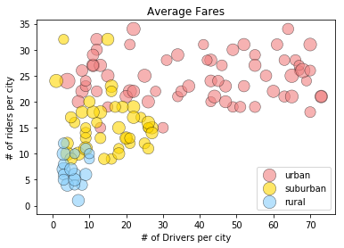
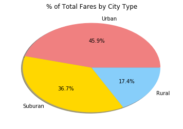
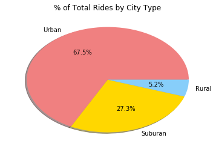
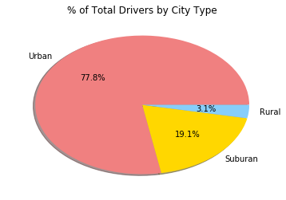

Your objective is to build a [Bubble Plot](https://en.wikipedia.org/wiki/Bubble_chart) that showcases the relationship between four key variables:

* Average Fare ($) Per City
* Total Number of Rides Per City
* Total Number of Drivers Per City
* City Type (Urban, Suburban, Rural)

In addition, you will be expected to produce the following three pie charts:

* % of Total Fares by City Type
* % of Total Rides by City Type
* % of Total Drivers by City Type

As final considerations:

* You must use the Pandas Library and the Jupyter Notebook.
* You must use the Matplotlib and Seaborn libraries.
* You must include a written description of three observable trends based on the data.
* You must use proper labeling of your plots, including aspects like: Plot Titles, Axes Labels, Legend Labels, Wedge Percentages, and Wedge Labels.
* Remember when making your plots to consider aesthetics!
  * You must stick to the Pyber color scheme (Gold, Light Sky Blue, and Light Coral) in producing your plot and pie charts.
  * When making your Bubble Plot, experiment with effects like `alpha`, `edgecolor`, and `linewidths`.
  * When making your Pie Chart, experiment with effects like `shadow`, `startangle`, and `explosion`.
* You must include an exported markdown version of your Notebook called  `README.md` in your GitHub repository.
* See [Example Solution](Pyber/Pyber_Example.pdf) for a reference on expected format.


```python
import numpy as np
import matplotlib.pyplot as plt
import pandas as pd
import os
# %matplotlib inline
```


```python
city_path=os.path.join("Pyber","raw_data","city_data.csv")
ride_path=os.path.join("Pyber","raw_data","ride_data.csv")
```


```python
df_d=pd.read_csv(city_path)
df_r=pd.read_csv(ride_path)
```


```python
df_d.head()
```


<div>
<style scoped>
    .dataframe tbody tr th:only-of-type {
        vertical-align: middle;
    }

    .dataframe tbody tr th {
        vertical-align: top;
    }

    .dataframe thead th {
        text-align: right;
    }
</style>
<table border="1" class="dataframe">
  <thead>
    <tr style="text-align: right;">
      <th></th>
      <th>city</th>
      <th>driver_count</th>
      <th>type</th>
    </tr>
  </thead>
  <tbody>
    <tr>
      <th>0</th>
      <td>Kelseyland</td>
      <td>63</td>
      <td>Urban</td>
    </tr>
    <tr>
      <th>1</th>
      <td>Nguyenbury</td>
      <td>8</td>
      <td>Urban</td>
    </tr>
    <tr>
      <th>2</th>
      <td>East Douglas</td>
      <td>12</td>
      <td>Urban</td>
    </tr>
    <tr>
      <th>3</th>
      <td>West Dawnfurt</td>
      <td>34</td>
      <td>Urban</td>
    </tr>
    <tr>
      <th>4</th>
      <td>Rodriguezburgh</td>
      <td>52</td>
      <td>Urban</td>
    </tr>
  </tbody>
</table>
</div>


```python
df_r.head()
```


<div>
<style scoped>
    .dataframe tbody tr th:only-of-type {
        vertical-align: middle;
    }

    .dataframe tbody tr th {
        vertical-align: top;
    }

    .dataframe thead th {
        text-align: right;
    }
</style>
<table border="1" class="dataframe">
  <thead>
    <tr style="text-align: right;">
      <th></th>
      <th>city</th>
      <th>date</th>
      <th>fare</th>
      <th>ride_id</th>
    </tr>
  </thead>
  <tbody>
    <tr>
      <th>0</th>
      <td>Sarabury</td>
      <td>2016-01-16 13:49:27</td>
      <td>38.35</td>
      <td>5403689035038</td>
    </tr>
    <tr>
      <th>1</th>
      <td>South Roy</td>
      <td>2016-01-02 18:42:34</td>
      <td>17.49</td>
      <td>4036272335942</td>
    </tr>
    <tr>
      <th>2</th>
      <td>Wiseborough</td>
      <td>2016-01-21 17:35:29</td>
      <td>44.18</td>
      <td>3645042422587</td>
    </tr>
    <tr>
      <th>3</th>
      <td>Spencertown</td>
      <td>2016-07-31 14:53:22</td>
      <td>6.87</td>
      <td>2242596575892</td>
    </tr>
    <tr>
      <th>4</th>
      <td>Nguyenbury</td>
      <td>2016-07-09 04:42:44</td>
      <td>6.28</td>
      <td>1543057793673</td>
    </tr>
  </tbody>
</table>
</div>


```python
# * Average Fare ($) Per City
# * Total Number of Rides Per City
# * Total Number of Drivers Per City
# * City Type (Urban, Suburban, Rural)
df_grp1=df_r.groupby("city")
s_grp1_avg=df_grp1.mean()["fare"]
s_grp1_rides=df_grp1["ride_id"].count()
df_grp1_drivers=df_d[["city","driver_count","type"]]


#merge tables
df_merge=pd.concat([s_grp1_avg, s_grp1_rides], axis=1)
df_merge=df_merge.rename(index=str, columns={"ride_id": "Rides per City", "fare":"Fare per City"})
merge_table = pd.merge(df_merge, df_grp1_drivers, right_on="city", left_index=True)
merge_table=merge_table.set_index('city')
print(merge_table.head())

df_urban=merge_table[merge_table["type"]=="Urban"]
df_subu=merge_table[merge_table["type"]=="Suburban"]
df_rural=merge_table[merge_table["type"]=="Rural"]
print(df_urban.head())


#plotting
# plt.figure(figsize=(50,10))
colors = ['lightcoral', 'gold', 'lightskyblue']

# urban = plt.scatter(random(10), random(10), marker='x', color=colors[0])
urban=plt.scatter(df_urban["driver_count"],df_urban["Rides per City"], s=merge_table["Fare per City"]*6, marker="o", facecolors=colors[0], alpha=0.6, label="urban", edgecolor="black",linewidths=0.5)
subu=plt.scatter(df_subu["driver_count"],df_subu["Rides per City"], s=merge_table["Fare per City"]*6, marker="o", facecolors=colors[1], alpha=0.6, label="suburban", edgecolor="black",linewidths=0.5)
rural=plt.scatter(df_rural["driver_count"],df_rural["Rides per City"], s=merge_table["Fare per City"]*6, marker="o", facecolors=colors[2], alpha=0.6, label="rural", edgecolor="black",linewidths=0.5)

plt.title("Average Fares")
plt.xlabel("# of Drivers per city")
plt.ylabel("# of riders per city")
plt.legend()

print("note: the size of the bubble represents the fare price. the size of the bubble is magnified by 6 times to show the difference in price.")
```

                  Fare per City  Rides per City  driver_count      type
    city                                                               
    Alvarezhaven      23.928710              31            21     Urban
    Alyssaberg        20.609615              26            67     Urban
    Anitamouth        37.315556               9            16  Suburban
    Antoniomouth      23.625000              22            21     Urban
    Aprilchester      21.981579              19            49     Urban
                  Fare per City  Rides per City  driver_count   type
    city                                                            
    Alvarezhaven      23.928710              31            21  Urban
    Alyssaberg        20.609615              26            67  Urban
    Antoniomouth      23.625000              22            21  Urban
    Aprilchester      21.981579              19            49  Urban
    Arnoldview        25.106452              31            41  Urban
    note: the size of the bubble represents the fare price. the size of the bubble is magnified by 6 times to show the difference in price.





```python
#Pie chart 1 - % of Total Fares by City Type

#calculate the total fare price by city type
urban_fare=df_urban["Fare per City"].sum()
subu_fare=df_subu["Fare per City"].sum()
rural_fare=df_rural["Fare per City"].sum()

print(urban_fare)
print(subu_fare)
print(rural_fare)


labels = ["Urban", "Suburan", "Rural"]
sizes = [urban_fare, subu_fare, rural_fare]
colors = ["lightcoral", "gold", "lightskyblue"]
plt.pie(sizes, labels=labels, colors=colors,
        autopct="%1.1f%%", shadow=True, startangle=0)
plt.title("% of Total Fares by City Type")
```

    1623.8633900239768
    1300.4339533158488
    615.7285717893218


    Text(0.5,1,'% of Total Fares by City Type')





```python
#Pie chart 1 - % of Total Rides by City Type
urban_r=df_urban["Rides per City"].sum()
subu_r=df_subu["Rides per City"].sum()
rural_r=df_rural["Rides per City"].sum()

print(urban_r)
print(subu_r)
print(rural_r)


labels = ["Urban", "Suburan", "Rural"]
sizes = [urban_r, subu_r, rural_r]
colors = ["lightcoral", "gold", "lightskyblue"]
plt.pie(sizes, labels=labels, colors=colors,
        autopct="%1.1f%%", shadow=True, startangle=0)
plt.title("% of Total Rides by City Type")
```

    1625
    657
    125


    Text(0.5,1,'% of Total Rides by City Type')





```python
#Pie chart 1 - % of Total Drivers by City Type

urban_d=df_urban["driver_count"].sum()
subu_d=df_subu["driver_count"].sum()
rural_d=df_rural["driver_count"].sum()

print(urban_d)
print(subu_d)
print(rural_d)


labels = ["Urban", "Suburan", "Rural"]
sizes = [urban_d, subu_d, rural_d]
colors = ["lightcoral", "gold", "lightskyblue"]
plt.pie(sizes, labels=labels, colors=colors,
        autopct="%1.1f%%", shadow=True, startangle=0)
plt.title("% of Total Drivers by City Type")
```

    2607
    638
    104


    Text(0.5,1,'% of Total Drivers by City Type')





```python
'''
Three observable trends based on the data:
1) Based on the bubble plot, there are more urban riders and drivers than rural riders.
2) The fare prices are not significantly different: from ~$20-$50.
3) Although rural drivers are only 3.1%, they represent 17.4% of the total fare.
'''
```


    '\nThree observable trends based on the data:\n\n1) Based on the bubble plot, there are more urban riders and drivers than rural riders.\n\n2) The fare prices are not significantly different: from ~$20-$50.\n\n3) Although rural drivers are only 3.1%, they represent 17.4% of the total fare.\n'


